Here are the slides and speaker notes from a talk I did at work on 28th March
2025. At [Netcraft](https://www.netcraft.com/), we run a lunch time tech talk
series in which staff talk about their interests, and this is a topic I've been
thinking about for a while. I had an audience of about 30 people and some
decent followup questions. I don't usually use speaker notes, preferring to use
bullet points and go with the flow, but for this talk I took relatively copious
notes, thinking they might be useful later.

Note that I don't intend for any of this to be considered offensive, but
Amateur Radio in the UK _really_ does have a reputation for being entirely
comprised of old guys chatting, and I hoped that showcasing some alternative
things I've found interesting might encourage my friends and colleagues to be
more interested.

I've tagged the all images that aren't OC, and this work is licensed under 
[CC BY-SA 4.0](https://creativecommons.org/licenses/by-sa/4.0/).

---

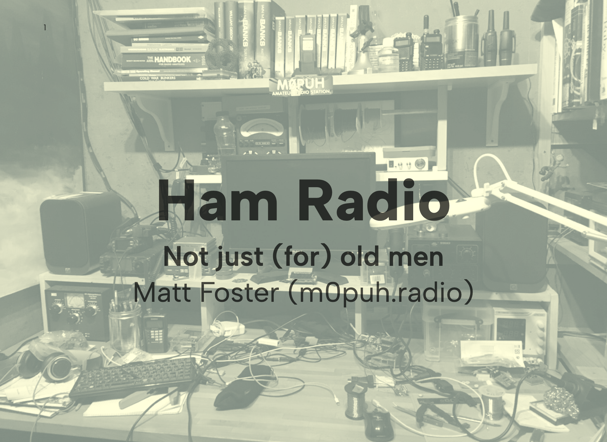

Ham radio in the UK has a reputation for basically being old men chatting in
their sheds using thousands of pounds worth of equipment, or of using Morse
code. I think this is a shame because there's much more to it than that, and I
wanted to spend a while explaining why the hobby might be of interest to
engineers, by talking about a few things I've found interesting, and giving you
a bit of background. I'll also talk a bit about how to get a license, and what
you can do with one. 

---

This talk is a tiny snippet of a huge area, and I've ignored or don't know
about thousand of things people spend countless hours on. There are literally
lifetimes of content I could have included here.

First off, to deal with the demographics - ham radio is absolutely mainly older
men, and there are really two (or maybe three) main reasons for this. 

--- 	

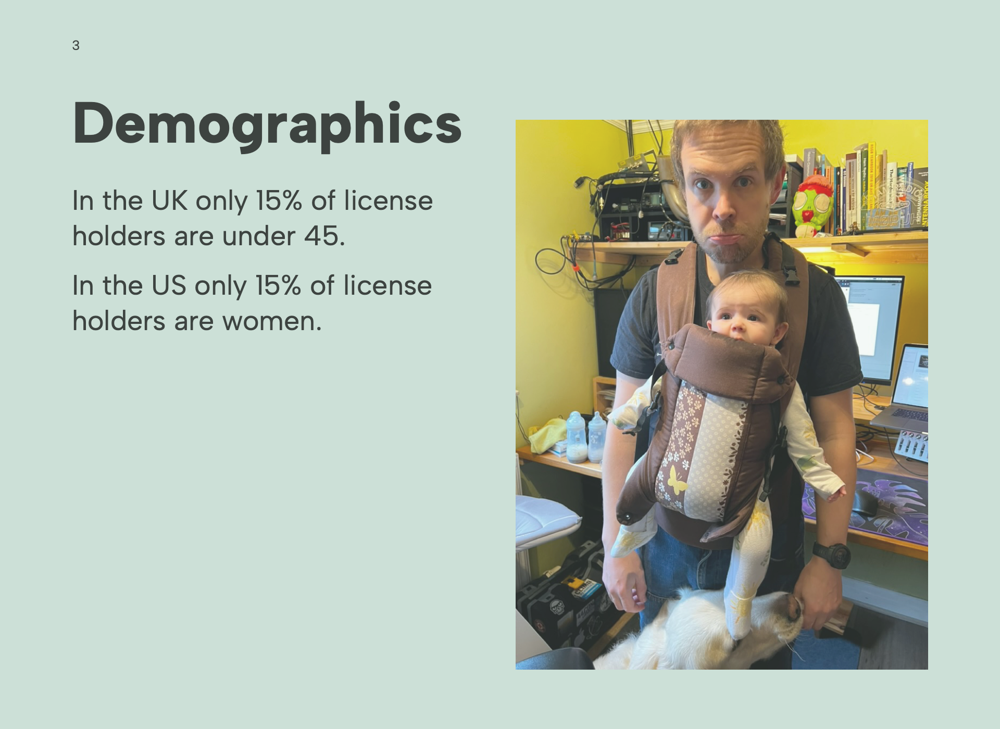

1. Male: I think that there are lots of men with radio licenses for the
same reason that tech is skewed that way - it's a giant male clique. In the US
only 15% of operators are women, and I'm not sure how that looks in the UK.

2. Older:  In the UK, only 15% of license holders are under 45.

In my experience a load of people with radio licenses were refugees from
changes to CB licensing in the early 80s, or they were license holders from
before then - often people who worked in radio or broadcasting.

Back when they were licensed being able to chat on a radio with your mates was
unique, which is totally unlike now, where it sometimes feels like it's almost
impossible to escape endless chats. 

I also saw a recent mastodon thread talking about how more women would get into
radio if widows were encouraged to start using their husband's radio gear,
which is certainly not going to help encourage many younger people.

I don't have specific solutions for the demographic problems, aside from trying
to explain some of the things I think younger people won't be put off by, so
that's the plan here. Incidentally, I think people in the US do a way better
job of outreach, with training at hacker conferences and a lot more interest,
but radio in some other countries is much more useful than it is here, with
emergency comms and coverage in large wilderness areas providing genuine
utility we don't really need here. Not that it isn't useful here for similar
things, but it's certainly less necessary!

---

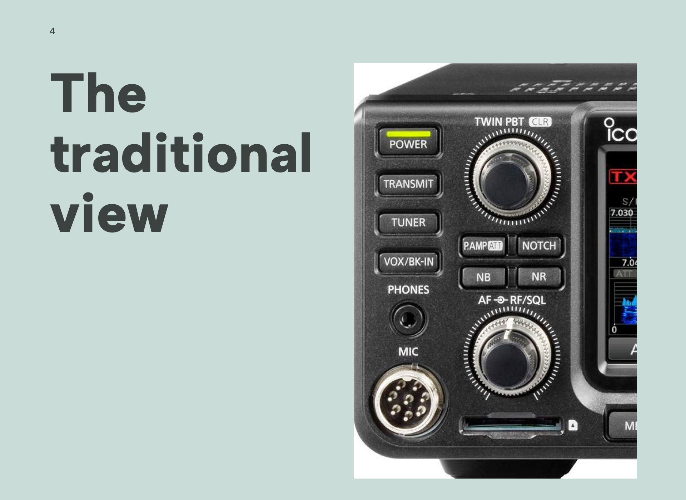

Image from icom website.

So, the traditional view of a radio operator is an older man, sitting behind a
desk of expensive gear with either a Morse code key or an expensive microphone.
And this is probably fairly accurate in many cases, but it's really the tip of
the iceberg. 

As you might expect you can buy extremely expensive radios, antennas,
amplifiers, power supplies and everything, and some people do just that. A lot
of people are happy to use off the shelf "appliances" and spend money at what
they enjoy without doing anything else, but in my experience this represents a
minority of people, and actually the hobby is really broad, and a lot of us
don't operate like that at all because there's so much other stuff to do. 

---

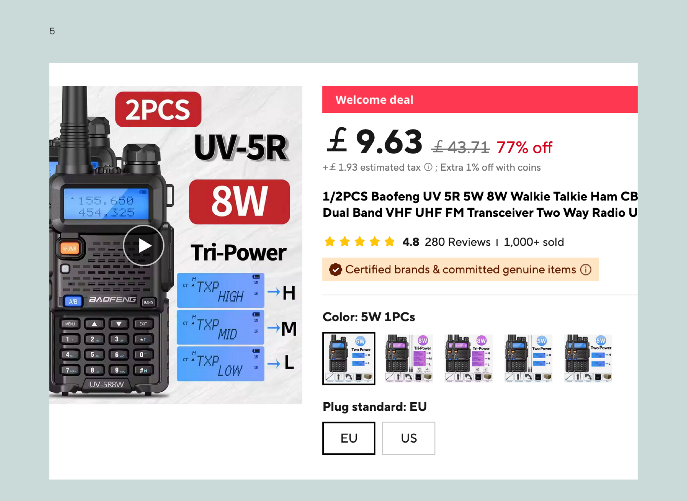

Image is screenshot of AliExpress, taken 28th March 2025.

Also, in recent years, Chinese radio gear has really disrupted markets, so you
will see and a lot of people are using relatively good kit that's super cheap.

So, before I start talking about other things, I will say that if you are
interested in talking with mainly local friends, a Foundation license will get
you the ability to use a radio like this, which will have a fairly limited
range, but you can use on local repeaters to improve coverage. 

In fact, for most people these days a foundation license is probably really all
you need. 

---

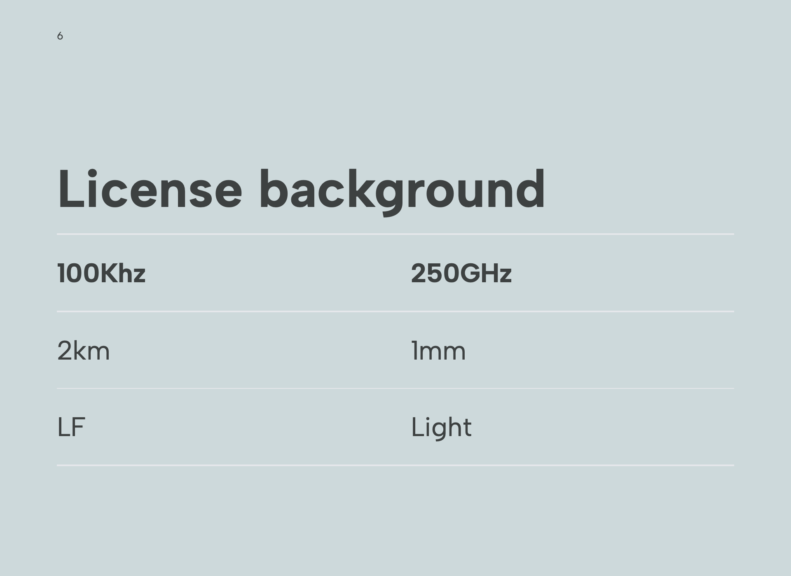

| 100Khz   | 250GHz    |
|----|----|
|  2km  | 1mm   |
| LF | Light |

An amateur radio license gives you access to various chunks of the
electromagnetic spectrum, ranging from about 100kHz in frequency to 250GHz. Or
wavelengths from 2km to 1mm.

It also lets you communicate with satellites, and gear on spacecraft like the
ISS. Other people bounce signals off the moon, meteor trails, rain, aircraft,
the structure of the troposphere, and of course the ionosphere, which people
are finding very exciting currently because of where we are in the sun's 11-ish
year cycle. 

The license allows you to build equipment to operate on these band, experiment
pretty widely, and communicate. And there's a license to make sure you know
what you're doing, primarily so that you don't interfere with other spectrum
users (which is everyone and everything at this point). It also gives you a
callsign which you can use to identify yourself, and which contains a bit of
info on your location and license type. 

So, as you can hopefully see, you don't just have to buy a radio and chat with
other people and there's a lot of interesting things to mess with. 

---

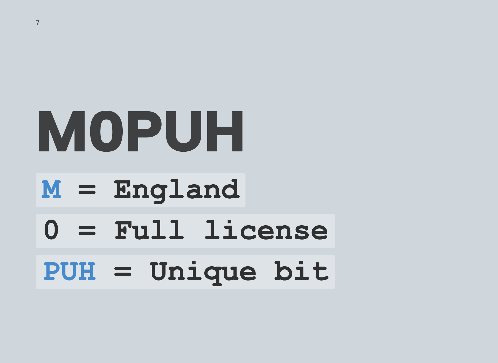

My callsign is M0PUH. The M means I'm in England, or more strictly now in the
UK. MW would be Wales, MM Scotland, and there are a few others. Other countries
have different letters, like F for France, EA for Spain, etc. 

0 means I have a full license, I start with 6 for foundation, then at
intermediate you currently get the weird 2E0 prefix for England. As you might
guess from a nerdy hobby, people collect contacts with call signs, and people
send cards to one another to confirm contacts.  

Finally, the unique part is either randomly allocated, or you can pick from
what's left. I picked PUH because Rob (a colleague) used to call me "matt puh
foster" because I had an IEEE post-it pad with "From the Desk of Matt P Foster"
written on it!

In the world of radio, people are almost always known by their callsign.

---

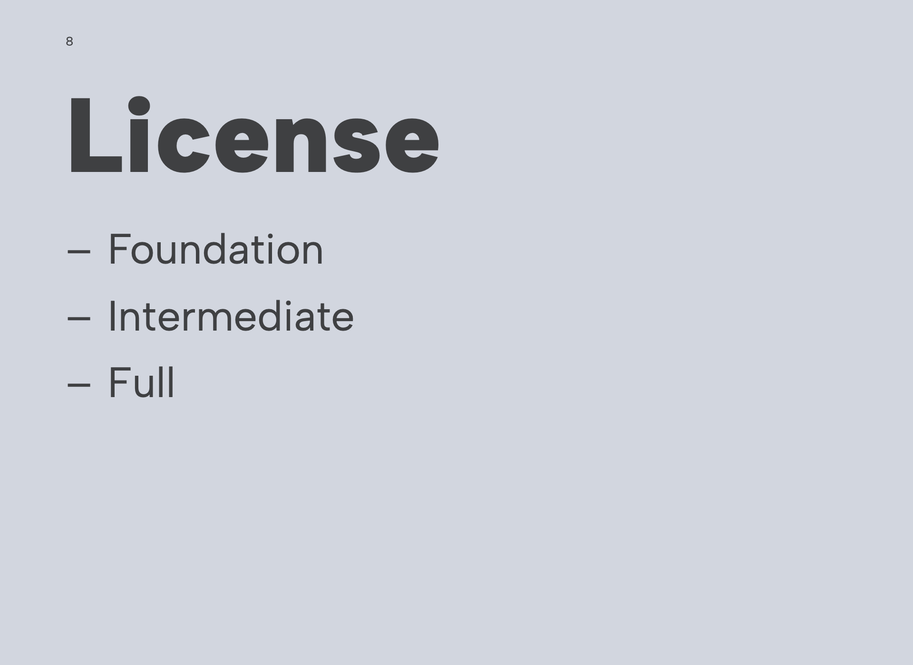

There are three levels of license, Foundation, Intermediate and Full, which
build progressively to give you a decent understanding of what's required to
build and operate radio gear safely and legally. This includes things like some
electronics, how radios work and are designed, antennas, how to use test gear,
and so on. Recent changes to licensing in the UK mean that for most people who
want to mess about, just having a foundation license is probably enough. 

Often, people who just want to chat find it annoying that you have to learn so
much more than that, but a lot of people find it super interesting, because it
means you can build things. 

---

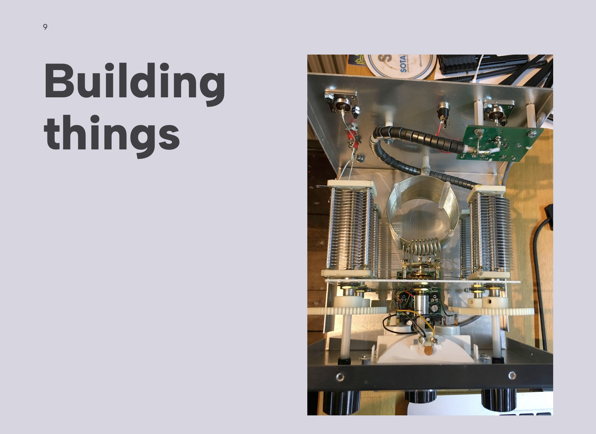

One thing that a lot of people do is build some or part of a system they can
use to transmit. For example, I got hold of an old radio from my Dad, then
built an antenna system in my garden by attaching a scaffolding pole to my
house and hanging a huge wire as high as I could get it. 

Then I used an antenna tuner I bought from a radio rally (basically a car boot
sale) to connect the radio to the antenna system. 

And then I got quite obsessed a data mode called FT8 which I talk about in a
bit. 

---

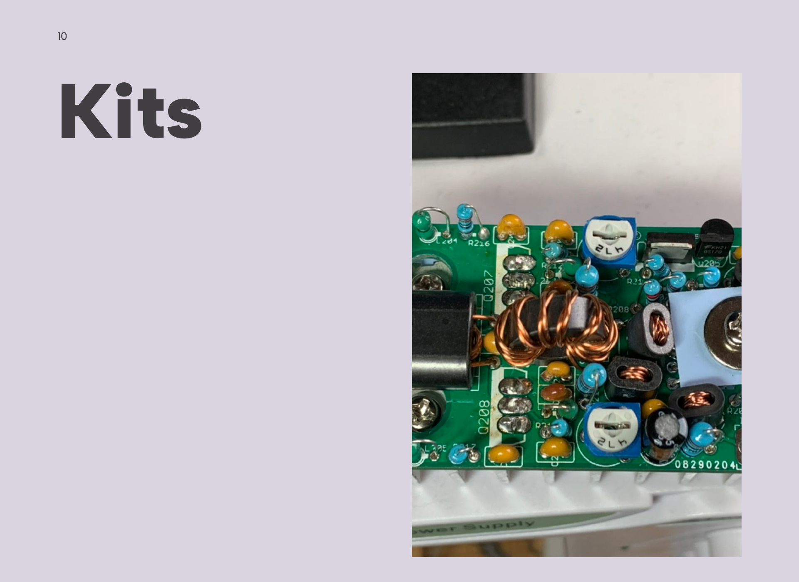

Other things people make include literally thousands of kits you can buy and
build yourself, ranging from full radios, through to giant power amplifiers and
dishes. 

This is an amplifier from QRP labs, which is a shop run by a radio amateur that
makes loads of fun kits, including super light weight trackers you could put in
a balloon, and full radio systems you can build yourself and use to transmit
and receive signals from across the world. 

---

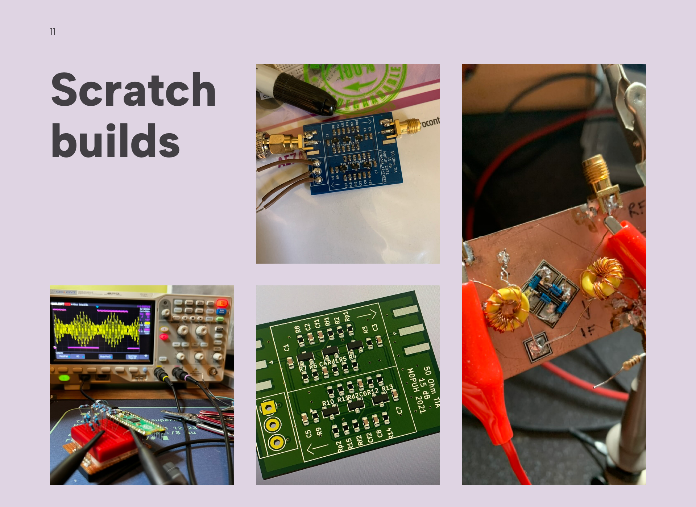

Here are some examples of a few things I've built over the last few years,
there's a small amplifier I designed and built a PCB for, a mixer, and me
messing with a Pi Zero to synthesise some signals. Lots of people do things
like this, and are eventually able to build radios from scratch, using their
own designs.

Essentially, you split things down into blocks (amplifiers, filters, mixers,
audio, mixers, etc), work out what each block needs to do, and then tackle them
one at a time. Some of the pics on this slide are my attempts at tackling
blocks. 

---

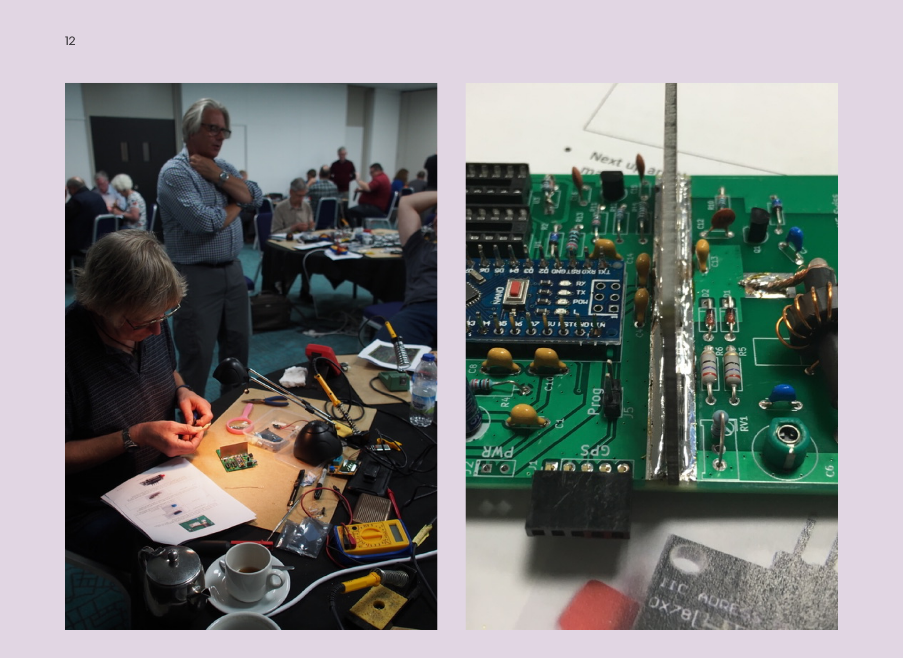

Buildathons can be a fun way to meet people, here's one I went to run by a
national club. In these events, everyone builds the same kit, which is
generally supplied and designed by the organised, and then gets to test it and
get help. 

The image here is the G-QRP club buildathon, showing my dad. I'll admit I was
the youngest person there but it was good fun.

---

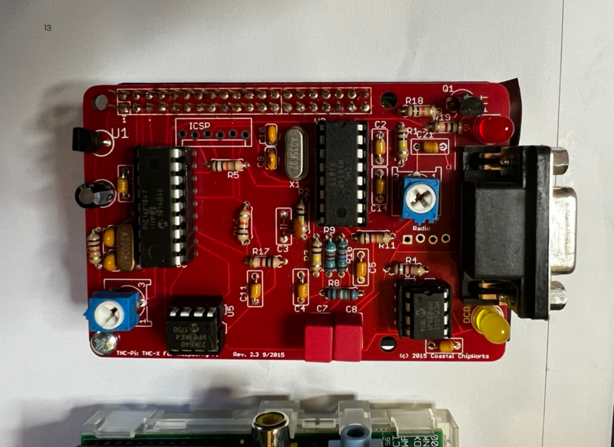

Raspberry Pi hats have made building complex gear way easier, by giving access
to decent hardware as well as allowing people to build useful UIs. I've built a
few different hats over the last few years, ranging from test gear (like a
device called a Wobbulator) to things like this, which is a modem called a TNCPi,
for use with packet radio modes like APRS (more on that in a bit). 

---

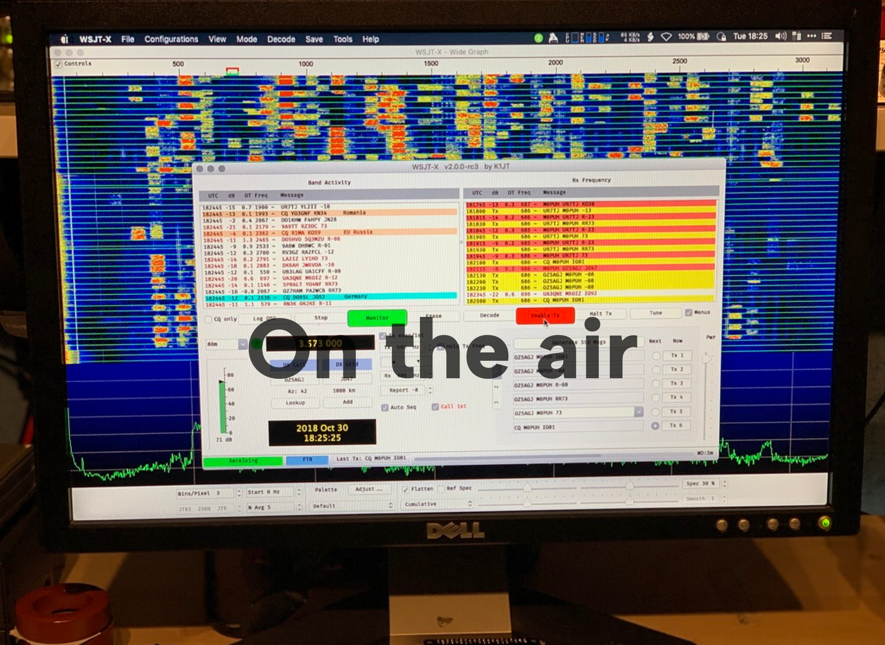

Of course, things have to move past the build stage at some point, and you
should probably use what you've built or bought. 

Options for doing this without actually speaking are pretty numerous, thanks to
_data modes_. 

The screenshot shows a program called WSJT-X, which was up and coming when I
got my license in 2017 but quickly became one of the most used data modes. 

This is a modern digital communication mode which lets you easily transmit low
power signals which can be received around the world. It was designed by Joe
Taylor (K1JT), a Nobel prize winning physicist, and Bill Smith (G4WJS), who died fairly
recently.

It sounds pretty weird, but with this mode you don't really talk, so much as
make semi automated contacts. It actually takes a bit of skill to do it
successfully. 

---

There are literally hundreds of data modes, including some which have been
around since the 1920s (RTTY) and others which are still being developed now.
Moderns modes tend to require less power, as they use modern encoding
techniques (like FT-8) and there's a lot of decent software you can use to play
with them. 

But as well as digital data modes there are also analog modes, like SSTV (slow
scan TV) - here's an image I received a few years back. 

As well as analogue images, like this, people do experiment with digital TV,
including terrestrially, and with drones and satellites. In fact there's a
Qatari geostationary satellite called ES'HAIL which has an amateur payload
people can use for a load of different things, and I've seen a few talks on
people modifying satellite TV gear for transmitting and receiving using this. 

If you like the idea of TV, check out BATC, and if you think satellites sound
fun, look at AMSAT.

---

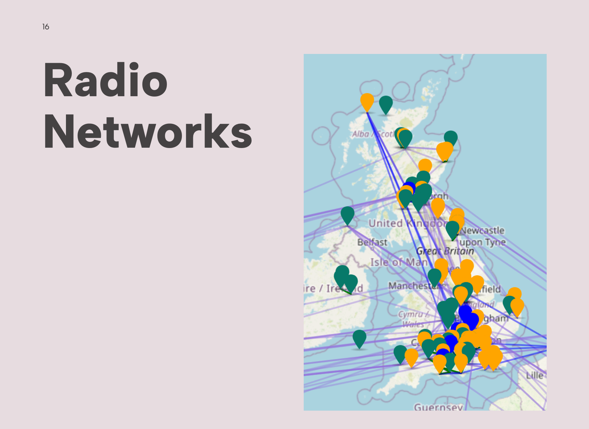

I've already mentioned data modes, but since the early days of the internet
people have been building networks with radio. In the late 70s, when ARPANET
was being built there was a radio version called PRNET, which used a protocol
called AX.25. This has been used since then, with varying levels of popularity
(I think it peaked in the 80s), and it allows people to run radio based BBSes,
and TCP/IP networks.

In fact, during the early days of the net, the ham radio community managed to
get whole of an entire class A block of IP addresses - 44. 44net makes chunks
of addresses available to licensed amateurs all over the world and you can use
it for basically anything. A few years ago, ARDC, who runs 44net sold a block
of 44net and now use it to provide grants for interesting tech and radio
projects. 

Ham radio workbench 229 has a great intro to this, and the modern ham has some
great posts on this. 

---

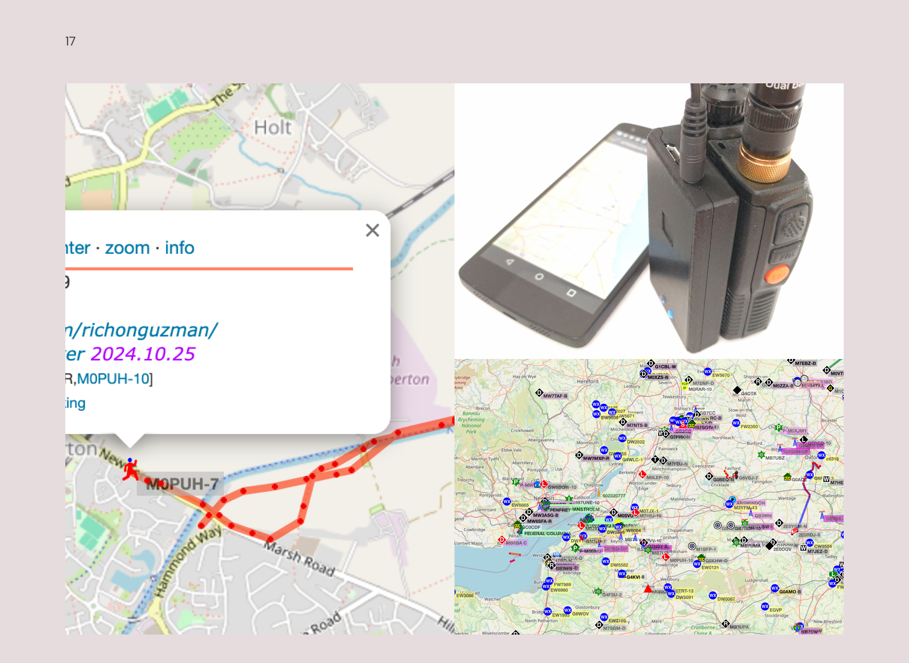

These days, when people talk about packet radio they almost always mean APRS.
APRS is widely used for telemetry, and supported by a load of radios, phone
apps and projects. 

This system works by people running receivers called iGates which listen on a
specific frequency for APRS packets and then send them to the net, or
rebroadcast them to other receivers. 

The transmitters are either built into radios, small trackers you can buy or
build, or things that connect to a phone using an audio cable or bluetooth and
then use a cheap walkie talkie to transmit. 

---

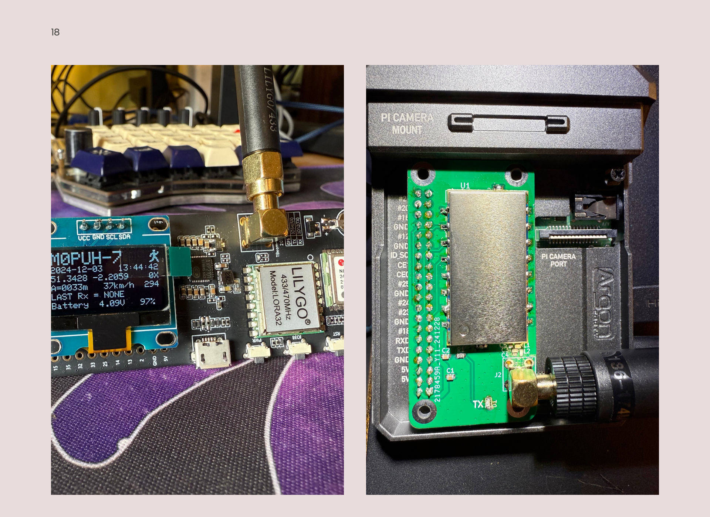

As well as APRS, people are using more modern communications schemes and
hardware to build networks and systems. 

One popular example at the moment is meshtastic. This uses LoRa hardware (which
is cheap and you don't need a license for) to build a mesh network which you
can then use for off grid comms (text messaging etc). 

The left image here shows a tracker which transmits in the hand band and uses
APRS over LoRa. 

There are also some attempts to reinvent things like APRS using more modern
tools. One project, cats.radio has firmware written in rust, and uses cheap
Chinese radio modules. The image on the right shows a Pi had for CATS, next my
list is building a tracker board, but I've not had time to get to that yet. 

Other similar projects include NPR (new packet radio) which bridges and
ethernet interface over a radio link.

---

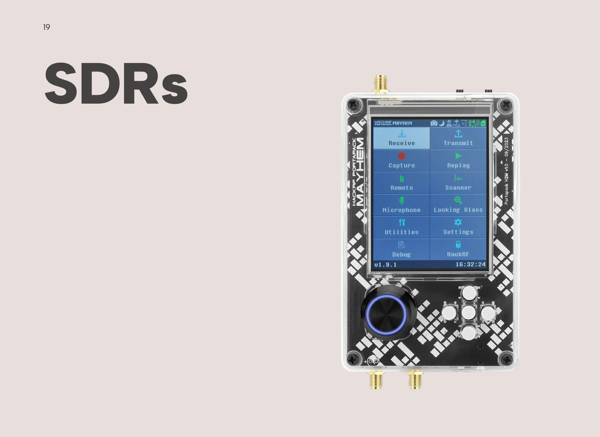

Note: this is as far as I got in 30 mins. Also note this image is from LAB401.

Software defined radios started transforming how people build radio almost 20
years ago, by removing the need for a lot of single purpose hardware. 

I expect some people here have used cheap RTL SDR dongles for some things like
receiving aircraft transponders, and there are hundreds of web SDRs online
which you can use to listen to basically anything. I sometimes like listening
to numbers stations.

As well as that you can buy tools like the HackRF which let you transmit as
well as receive, and give you full control over the software. GNU Radio is one
project that gets heavy use in this space, as it lets you build full radio
systems in software, but there are also loads of desktop listening apps. 

---

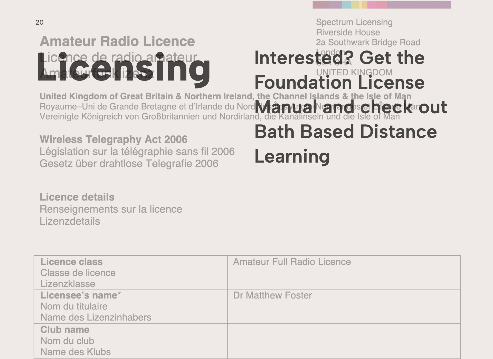

I got my foundation license in 2017 because my dad (an actual OM) had been
hassling me for years and I was interested in learning something new and
topping up my electronics knowledge. I started by reading the RSGB foundation
license manual, decided it seemed pretty straightforward, then found "Bath Based
Distance Learning", which exists to help people get licensed. I actually live
close to Bath, so there was no real distance to contend with. I emailed the
organiser, Steve (G0FUW), and he quickly emailed me some sample exam questions
and organised a in-person meeting to take me through there basics (at that
point there was a practical part of the exam). That was at the end of October.
I booked and passed the exam in the first half of December and enrolled
immediately onto a distance learning intermediate course which had already
started. I also found this pretty straight forward and interesting, and the
intermediate exam in mid January (this also had a practical element at the
time, which I think disappeared in the pandemic - most exams are now remote). 

Finally, I joined an "advanced" classroom course in Bath to study for a full
license (it was a couple of hours a week, plus homework), this ran until June,
and I passed that in the end of June. This in-person course was really
interesting, and the instructors were amazing.

I found the process really fun fun and learned a lot about practical electronics
(despite having an electronics degree!) and radios. You can probably tell I
don't really do voice comms, but hopefully I've shown that there's masses of
other things you can do as well. 

As I said, I haven't even touched on so many things here, like radio astronomy,
science, clubs, etc. It would have been great to go into more detail on so many
things but hopefully this has been interesting!

---

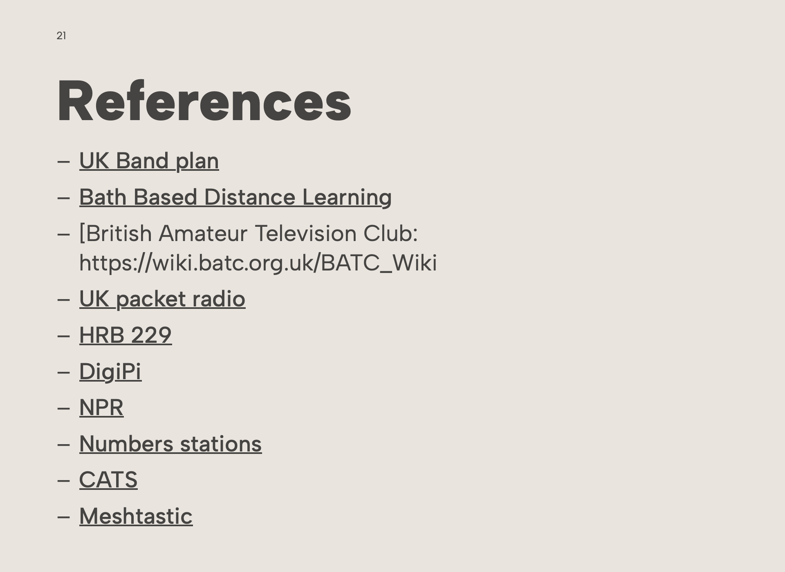

* [UK Band plan](https://rsgb.services/public/bandplans/docs/radcom_band_plans_march_25.pdf)
* [Bath Based Distance Learning](https://moodle.bbdl.org.uk/)
* [British Amateur Television Club](https://wiki.batc.org.uk/BATC_Wiki)
* [AMSAT](https://amsat-uk.org/)
* [UK packet radio](https://ukpacketradio.network/)
* [HRB 229](https://www.hamradioworkbench.com/podcast/hrwb-229-all-about-44-net-and-the-ardc)
* [DigiPi](https://craiger.org/digipi/)
* [NPR](https://hackaday.io/project/164092-npr-new-packet-radio)
* [Numbers stations](https://priyom.org/number-stations)
* [CATS](https://cats.radio)
* [Meshtastic](https://meshtastic.org/)
* [Termination insensitive amplifier](https://w7zoi.net/bidirectional_matched_amplifier.pdf)
* [TNCPi](https://www.tnc-x.com/TNCPi.htm)

