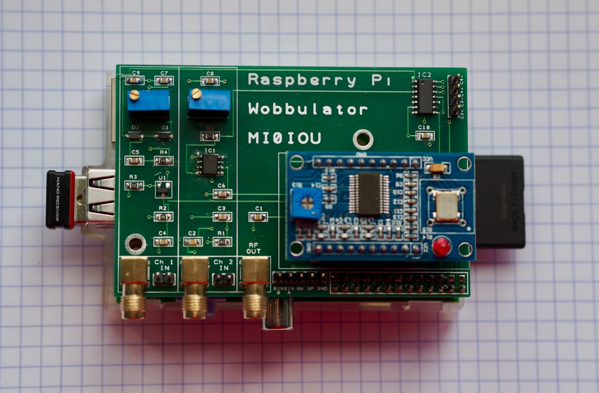

Built a Raspberry Pi Wobbulator and stuck it on top of an old Pi I wasn't using (everyone has at least 2). It works and was fun to build! Got it via: [http://asliceofraspberrypi.blogspot.com/2013/12/building-raspberry-pi-wobbulator-kit.html](http://asliceofraspberrypi.blogspot.com/2013/12/building-raspberry-pi-wobbulator-kit.html)

Looking forward to building and measuring some home made filters with it once I've found some SMA cables.

The blue board on the right is a DDS module which it uses to generate a sweep of varying frequencies, then there are two inputs which measure voltage.

