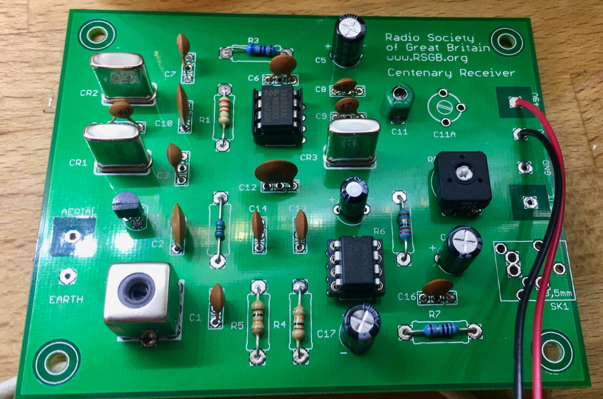
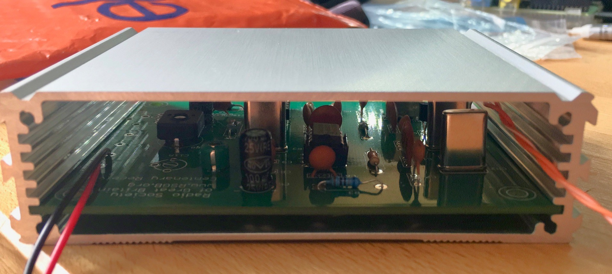
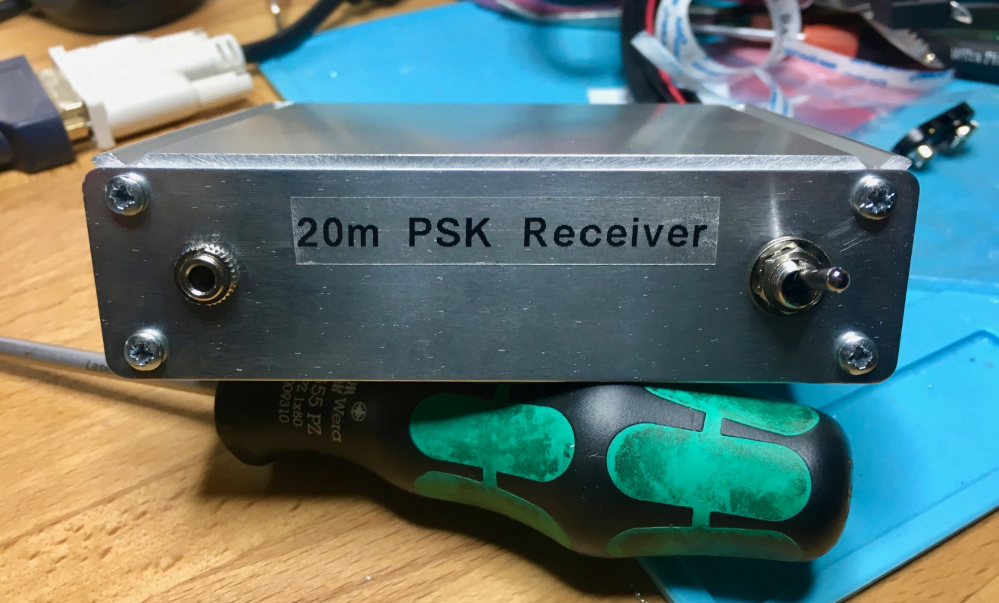

One of my staycation projects this year was the RSGB Centenary PSK Receiver.

I got the PCB from RSGB ( [https://www.rsgbshop.org/cgi-bin/sh000044.pl?WD=psk&PN=Kits%2ehtml#a1385](https://www.rsgbshop.org/cgi-bin/sh000044.pl?WD=psk&PN=Kits%2ehtml#a1385)) and the bits I didn't already have from Spectrum ( [http://www.spectrumcomms.co.uk/](http://www.spectrumcomms.co.uk/)), and then I bought an extruded aluminium enclosure from eBay to finish it off.

The build took about an hour in total and was all through-hole. The instructions also provide basic functionality tests which was a nice touch. Boxing it up took about another hour.

Not massively useful, but fun!

