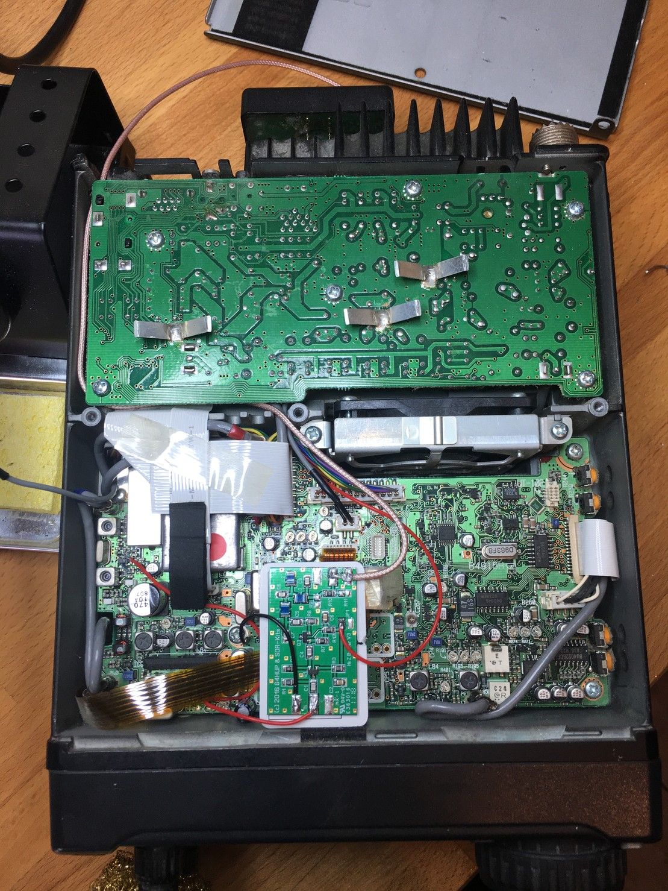

hupRF/SDR kits PAT installed and it *seems* to work. Just need to get my head around driving the rtlsdr properly, and then finally think about a Raspberry Pi.

Really tempted to get a decent SDR at some point... also surgery on my only proper rig scares me! Time for a drink. [https://mastodon.radio/media/PhMNcTrzDtobpAKZhik](https://mastodon.radio/media/PhMNcTrzDtobpAKZhik)

