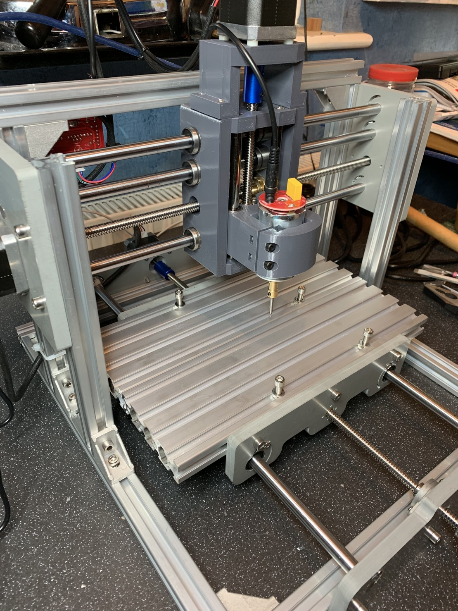
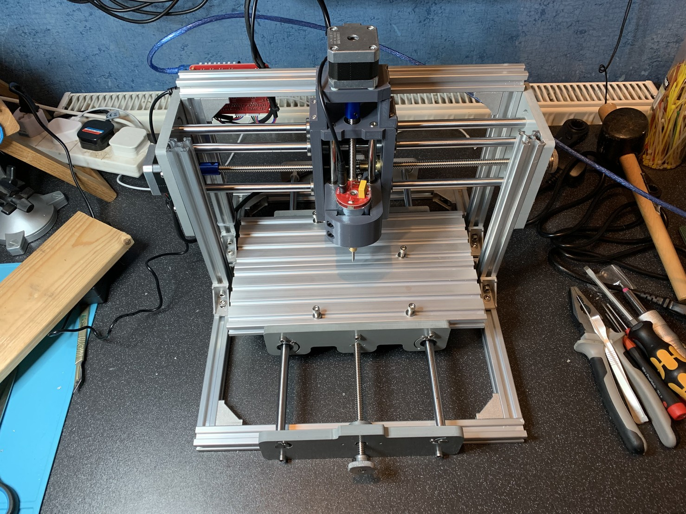

This weekend I build a cheap Chinese CNC engraver. I don’t have any specific uses for it in mind (maybe making some PCBs eventually) but fancied making something a mechanical, and the total cost was under £150.

The thing didn’t come with instructions, but I found some for a similar unit and I guess it took about 6 hours to build.

I think adding limit switches is a must and to do anything more than simple engraving will need a spindle upgrade, but so far, so fun!

