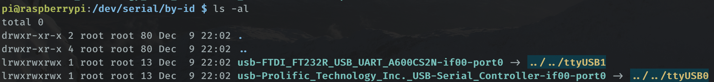
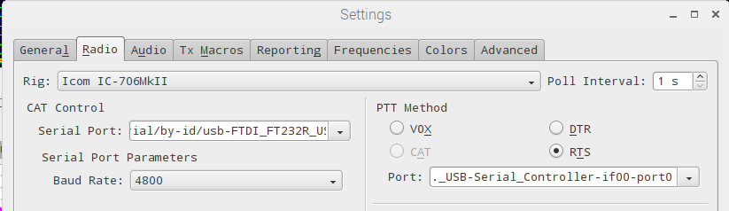

[#TIL](https://mastodon.radio/tags/TIL): /dev/serial/by-id/ has persistently named serial devices on [#Linux](https://mastodon.radio/tags/Linux).

Perfect if your serial ports keep swapping over when you reboot or plug/unplug things, just use these in places of /dev/ttyUSB$no.

I don't know when this magical feature appeared but it beats messing with dev rules. 💻📻

[#digimodes](https://mastodon.radio/tags/digimodes) [#linux](https://mastodon.radio/tags/linux)

