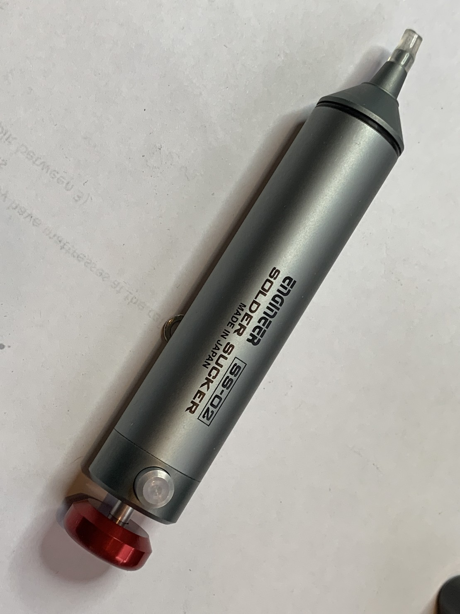

My new favourite tool is this Engineer solder sucker. The tubing on the end makes a huge difference to the amount of suction you get.

Naturally, the writing on it is only the right way up when it’s in your right hand!

