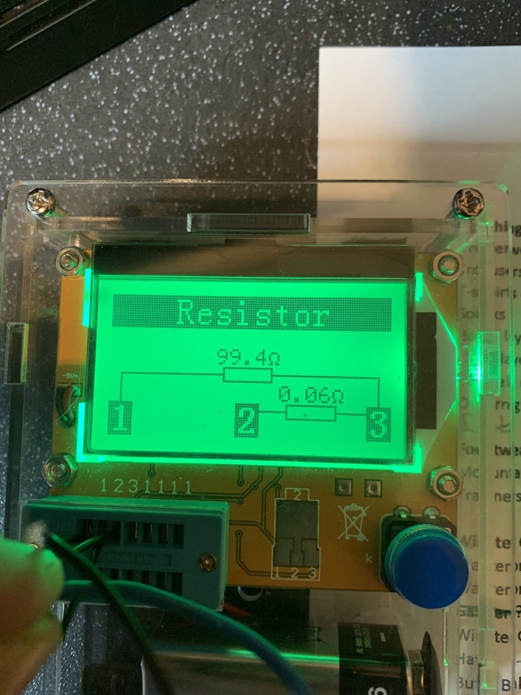
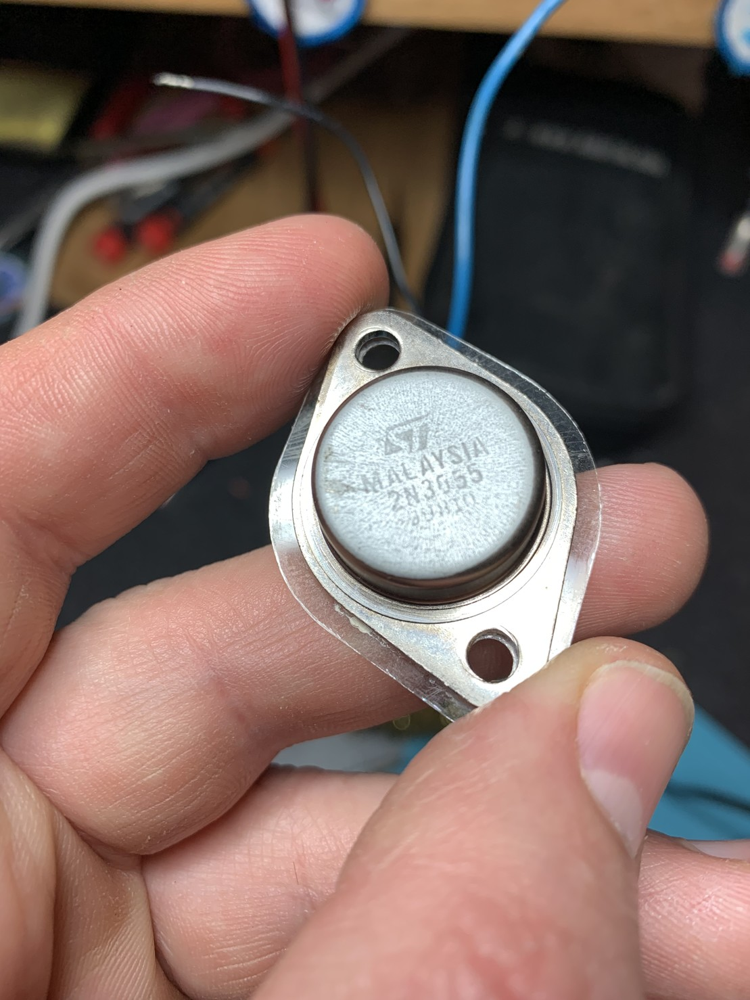

Found this page on my dead PSU [https://pa0fri.home.xs4all.nl/Diversen/EP925/ep925eng.htm](https://pa0fri.home.xs4all.nl/Diversen/EP925/ep925eng.htm) which makes it sound like one of these beefy 2N3055 transistors has probably died.

No sign of scorch marks etc though! 🕵️‍♂️

I still think dumping the full 24 volts across the terminals is a rubbish failure mode.

Dead transistor now identified!

Attached is how my cheapo component tester said it behaves now. Basically a short from collector to emitter, and that’s how I found it (meter on continuity mode, testing across disconnected transistors).

Tempted to replace all of them as they’re not too expensive.

