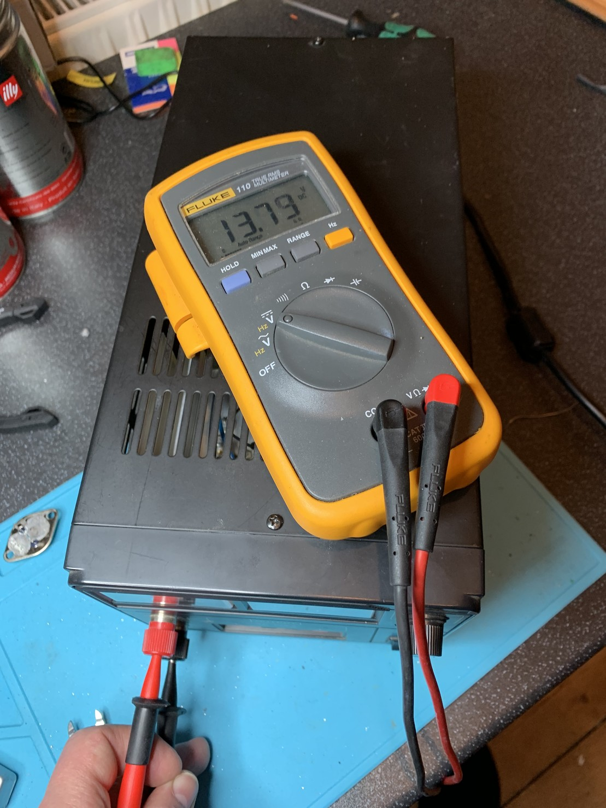
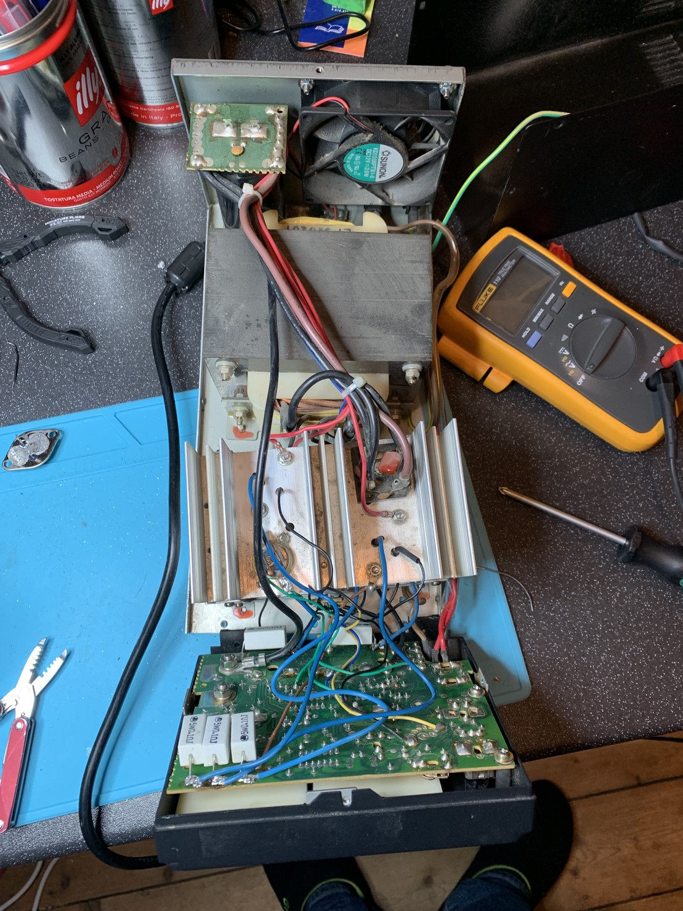

Managed to repair my PSU by replacing the faulty pass transistor, and all the others for good measure.

Now added “research overvoltage protection circuits” to my never ending todo list! Looks like there are plenty of options.

Super happy the repair worked and there doesn’t seem to have been anything else wrong with it. 🙌

