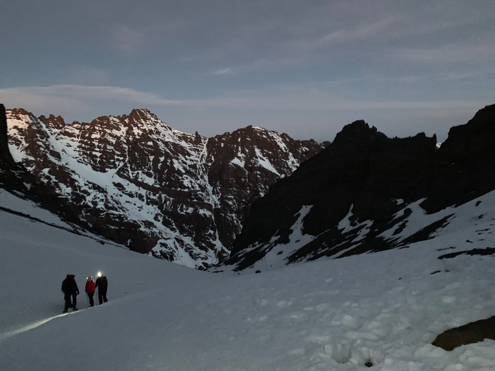
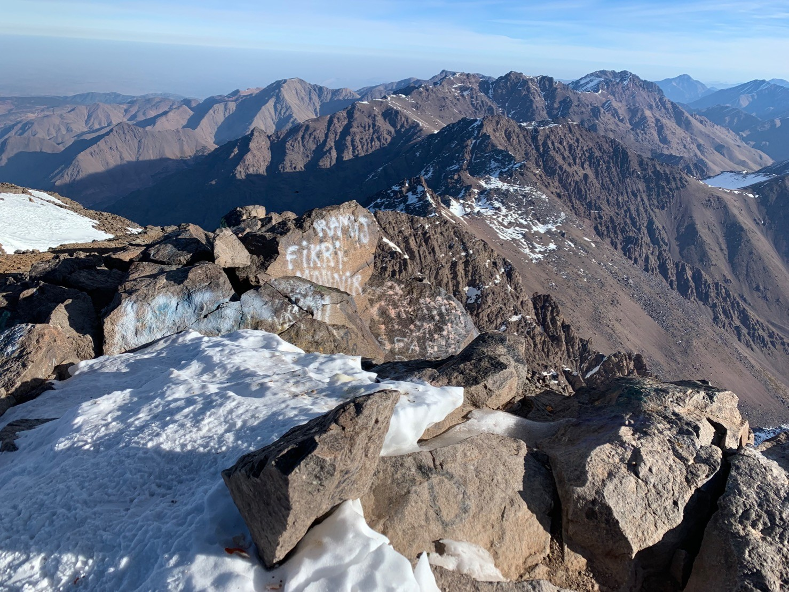
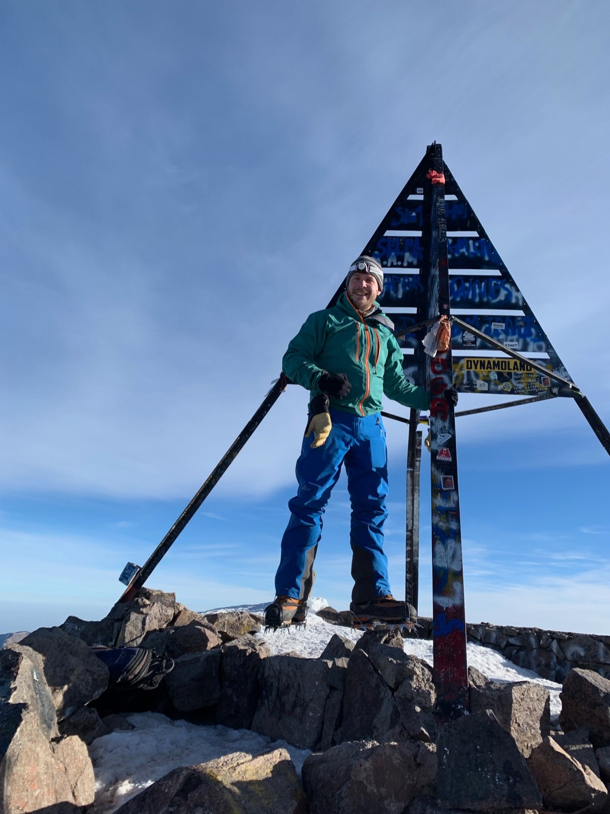

Had a lot of fun climbing Toubkal in Morocco last week, but didn't take a [#amateurradio](https://mastodon.radio/tags/amateurradio) as getting licensing sorted looked complicated and I was worried about customs (also I don't speak Arabic or French)!

The altitude made it hard work, but it was totally worth it.

