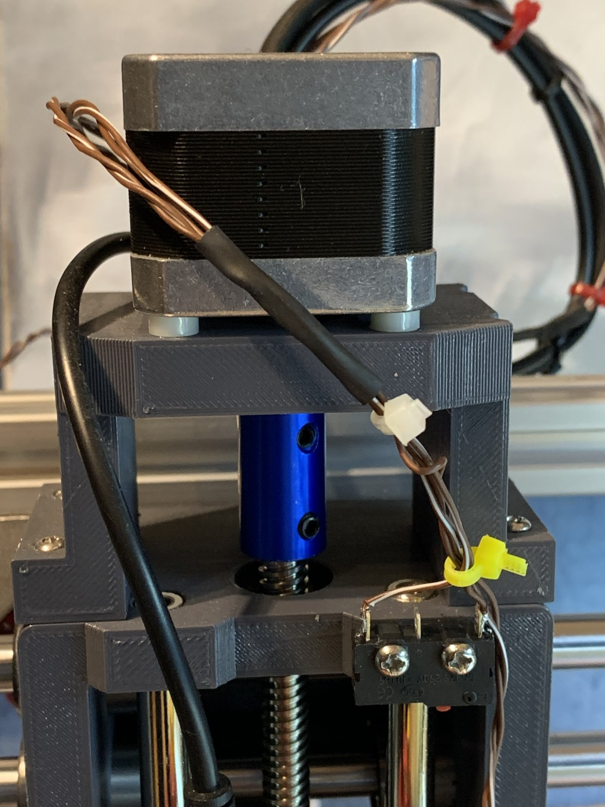
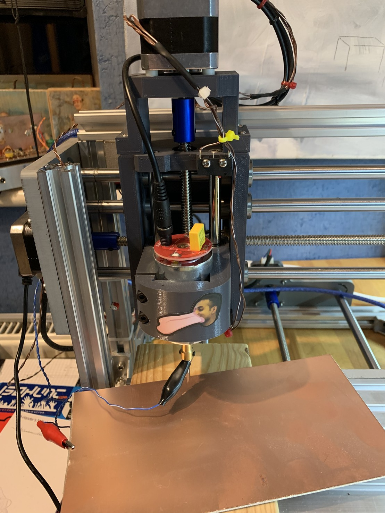

I’ve added some quick and dirty limit switches and a z-probe to my 2417 CNC, and also updated the GRBL version to the latest!

I’ve learned a lot about how it works and think I might almost be ready to use it in anger. Of course I still have a more beefy spindle to install and some new connectors to crimp...

