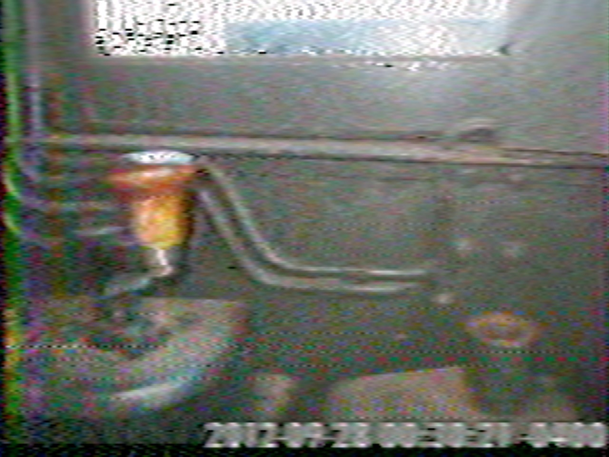

Managed to record some of the ISS’s warblings using my phone’s voice recorder and decoded this. Not sure what it is to be honest. Next time I’ll be better prepared! [#sstv](https://mastodon.radio/tags/sstv) [#amateurradio](https://mastodon.radio/tags/amateurradio)

When my pi is less busy I’ll try QSSTV, This decoded pretty fast so I must be missing part of it!

