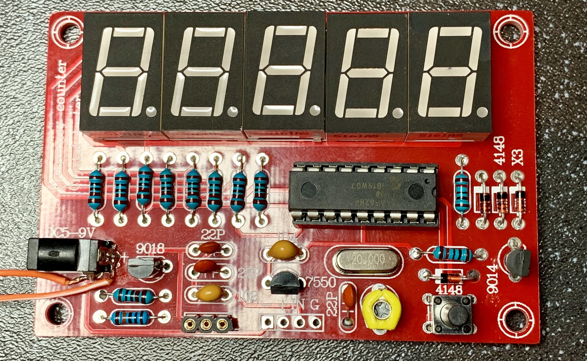
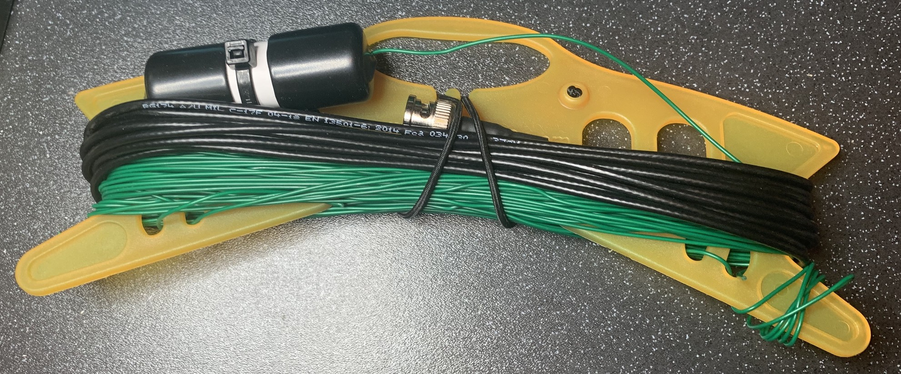

Didn’t manage to do everything I wanted to this weekend, but I did manage to build my £3 crystal tester, and this SOTABEAMS end fed tuner, plus wire it up ready for a test a tune on 40m.

I also managed to make up some test resistors to calibrate my cheap SARK 100 antenna analyser clone.

Actually I’m pretty happy with that list of stuff!🤔

