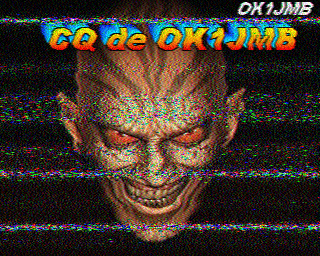
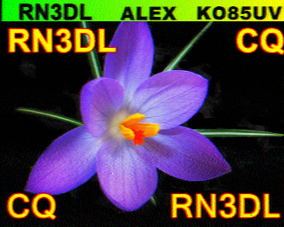

Spent a while yesterday receiving SSTV images on 20m (14.230 MHz), some pretty scary and really interesting.

I don't think anyone would deny that it's a pretty weird way to communicate, super fun though. Next I need to work out how to TX with qsstv (but first, family stuff)!

[#hamradio](https://mastodon.radio/tags/hamradio) [#amateurradio](https://mastodon.radio/tags/amateurradio) [#sstv](https://mastodon.radio/tags/sstv)

