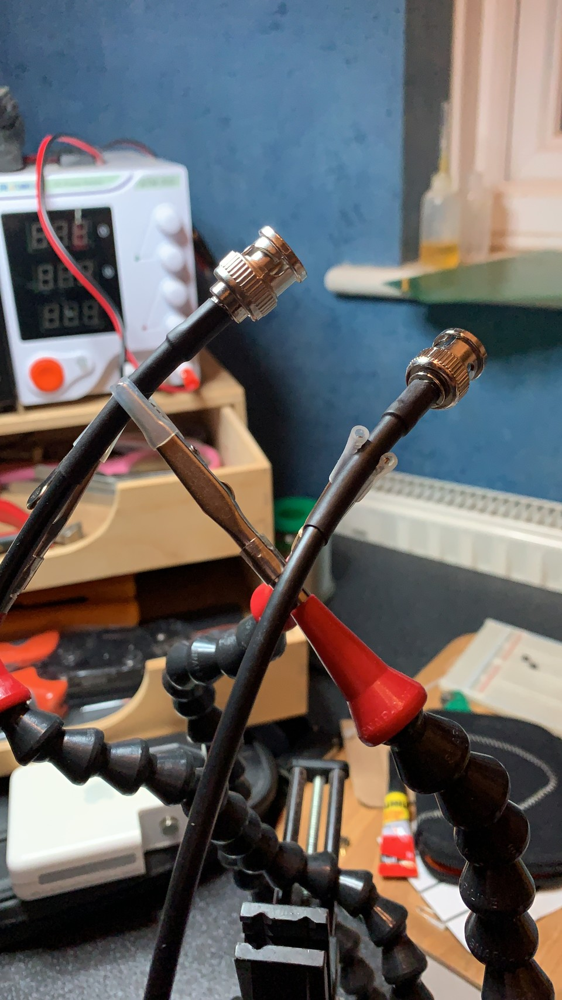

Been busy with other stuff recently so not done much radio/electronics but I made this BNC patch cable for @2w0kpf last night.

Pretty pleased with how it turned out.

Crimp connectors are great once you get the hang of them!

[#hamradio](https://mastodon.radio/tags/hamradio) [#amateurradio](https://mastodon.radio/tags/amateurradio)

