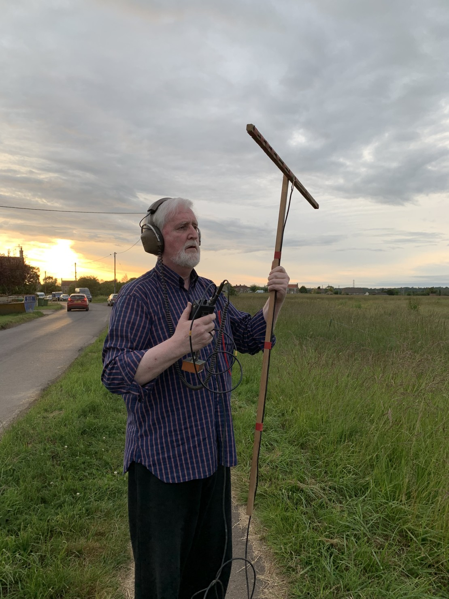

Had a lot of fun on the club’s fox hunt last night. It was my first, so I basically went to see how it worked. My team failed (mostly due to a lack of decent gear I reckon) but I will know what to do next time! First on the list is getting my tape measure antenna working.

Looking forward to it!

[#hamradio](https://mastodon.radio/tags/hamradio) [#amateurradio](https://mastodon.radio/tags/amateurradio)

Frank (G4YXS) holding a t shaped wooden antenna. The antenna is a dipole made of coax!

Whoops, that last but was supposed to be the image description. Not sure what I did there.

