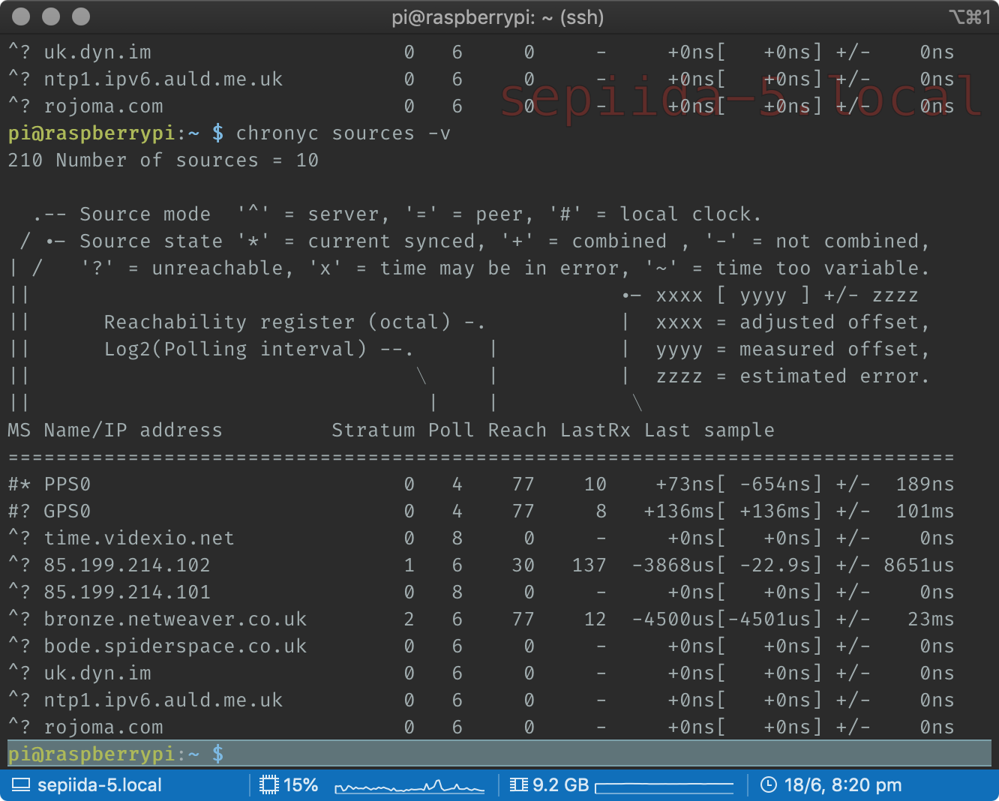
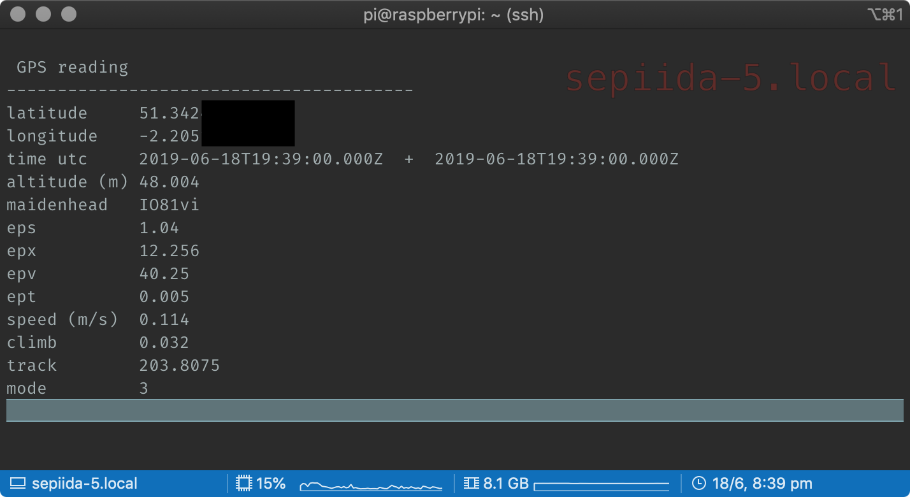

Finally got my Pi synced to the PPS pin on the GPS I plugged into it. It's currently indoors with a small ceramic antenna, but works.

Software is gpsd and chrony, hardware is a cheap ublox board with a hirose u.fl connector and a patch antenna, soon to be replaced with a chinese outdoor antenna.

The Pi is a model b, configured to use the standard UART (ttyS0) not the better one (ttyACM0), but that might need to change.

I think it'll be cool to add a little display with position/clock info.

