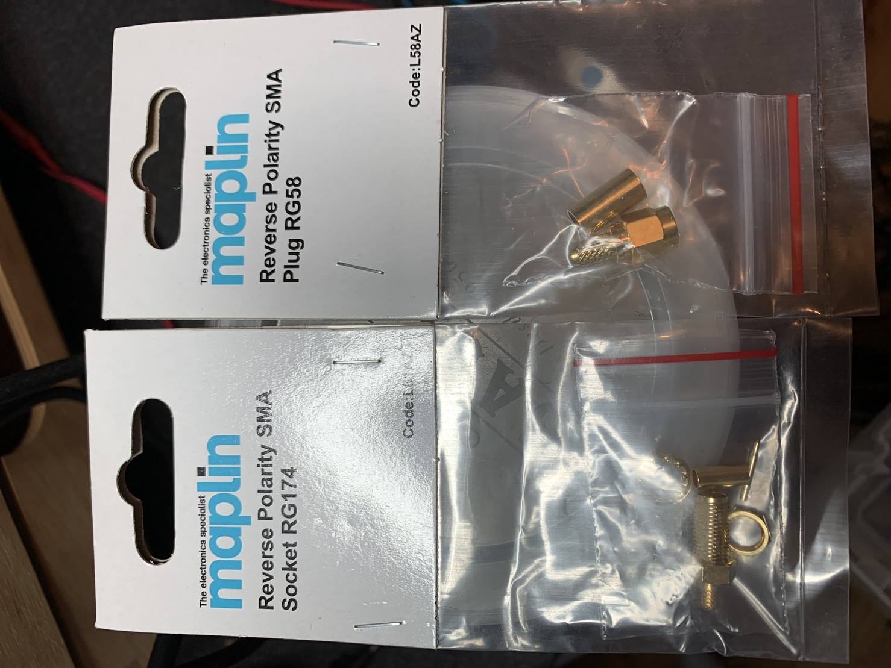

Talking of maplin. If anyone on this instance and in the UK wants any RP-crimp SMA plugs or sockets then let me know.

I’ll happily send a few (no charge!) to anyone who needs them. I think reverse polarity is generally used for WiFi gear. I have a bunch of each for RG174 and RG58.

I also have a load of other random connectors, just nothing particularly common, so if you’re looking for something odd then let me know and I’ll see what I have.

[#hamradio](https://mastodon.radio/tags/hamradio) [#amateurradio](https://mastodon.radio/tags/amateurradio)

