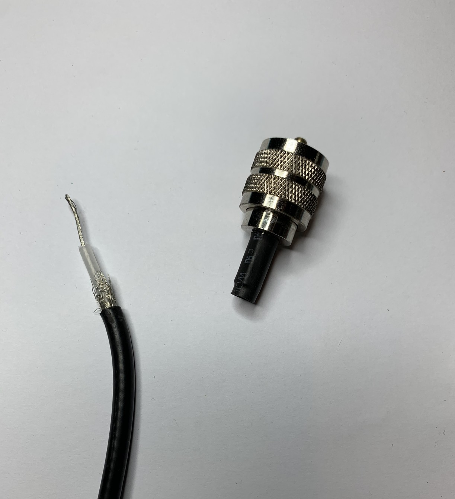

I just had a cheap AliExpress PL-259 patch cable fall apart in my hands. I guess you get what you pay for!

It was so badly crimped I was able to reuse the plugs and sleeves to make a new cable, with a slightly nicer bit of coax.

