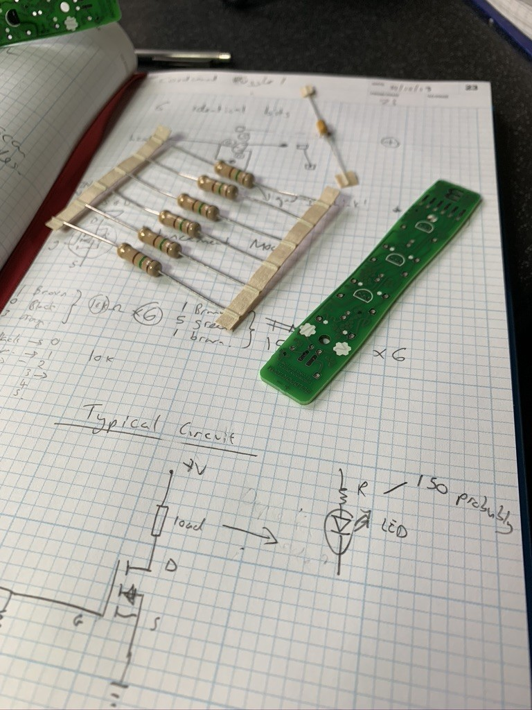
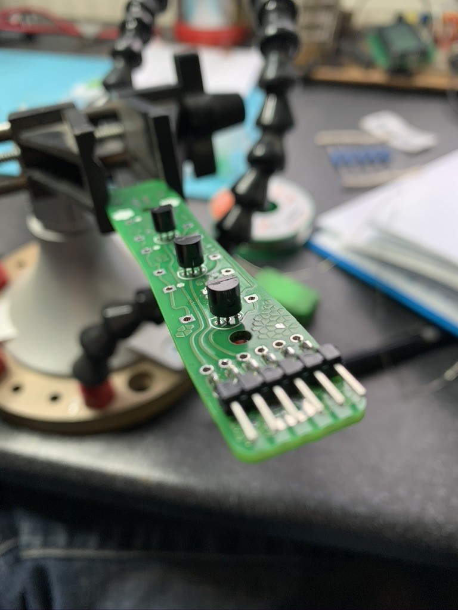
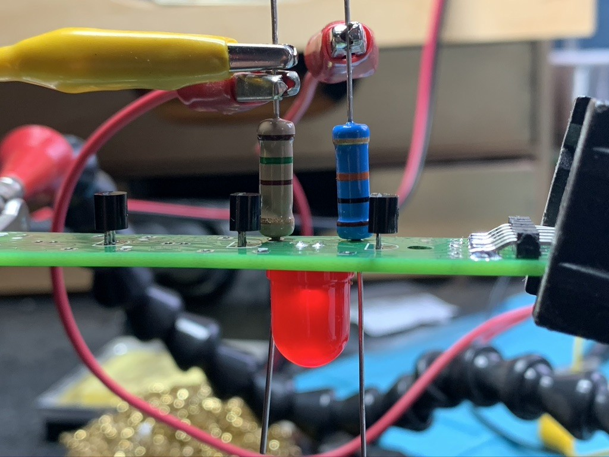
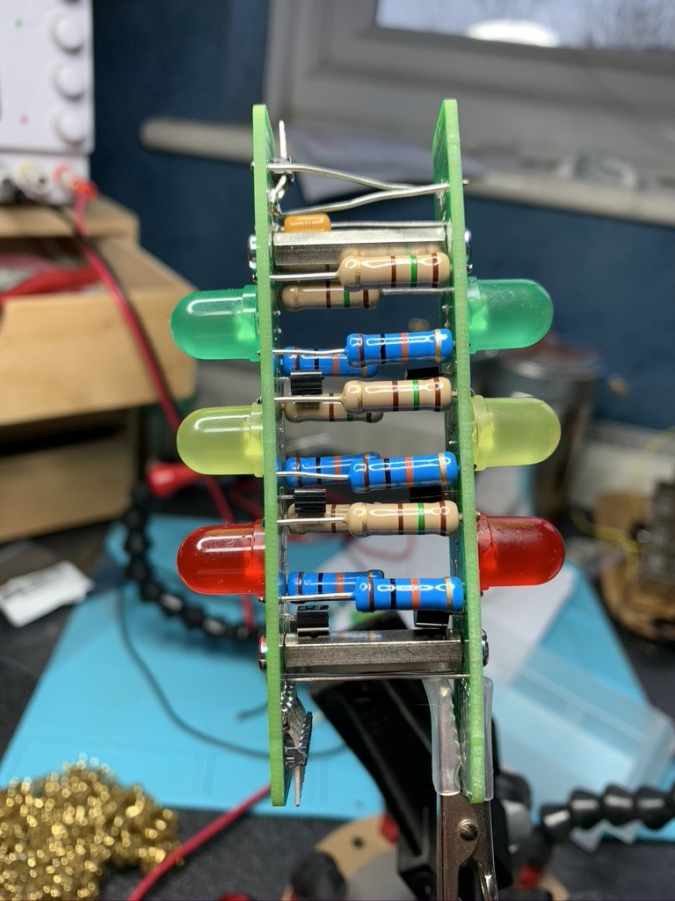

Today's project was Cordwood Puzzle 1, a secret santa present from a good mate.

Just hard enough to complete without cheating! (although I should have left the leads longer to keep things symmetrical).

Oh, and Happy New Year all!

