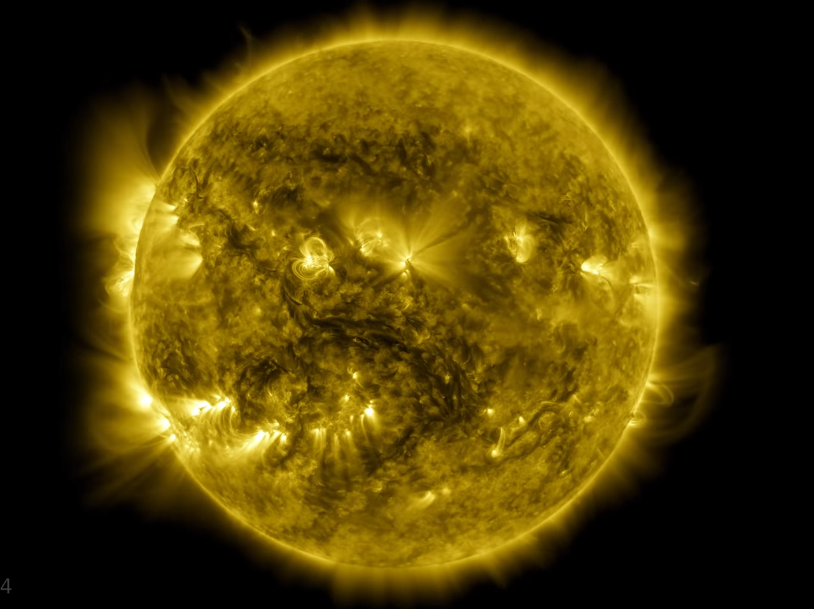

NASA have been making images of the sun every 0.75 seconds for a decade, that's pretty amazing.

They released a video where each second is a full day, at:

[https://youtu.be/l3QQQu7QLoM](https://youtu.be/l3QQQu7QLoM)

I found this via: [https://kottke.org/20/06/a-decade-of-sun](https://kottke.org/20/06/a-decade-of-sun)

which also lists the days a few cool things happened.

