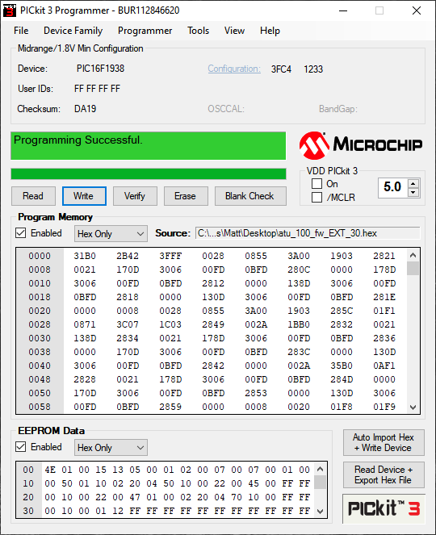

Almost downloaded a gig of MPLAB to try to program a PIC using a pre-supplied hex file...

... only to discover there's a tiny GUI tool for the PICkit 3 programmer I have. Win! Actually, I just used Windows as last time I tried this stuff on Linux it was really hard.

I definitely prefer AVR stuff, but I guess that's what I'm used to.

I'm building an N7DDC ATU kit from eBay.

