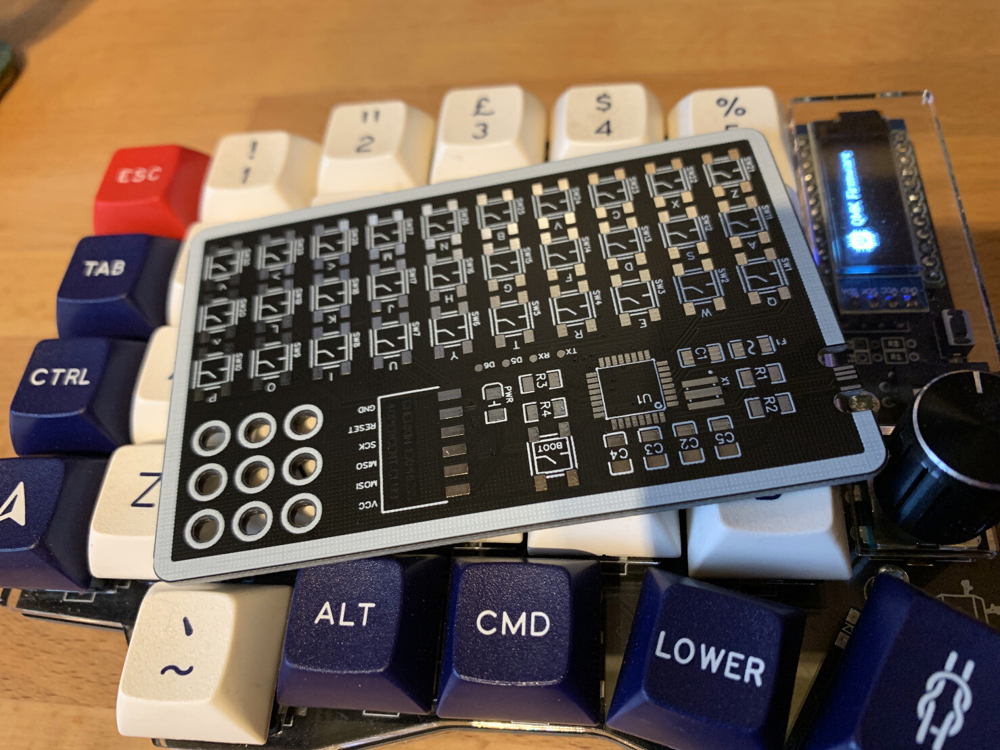
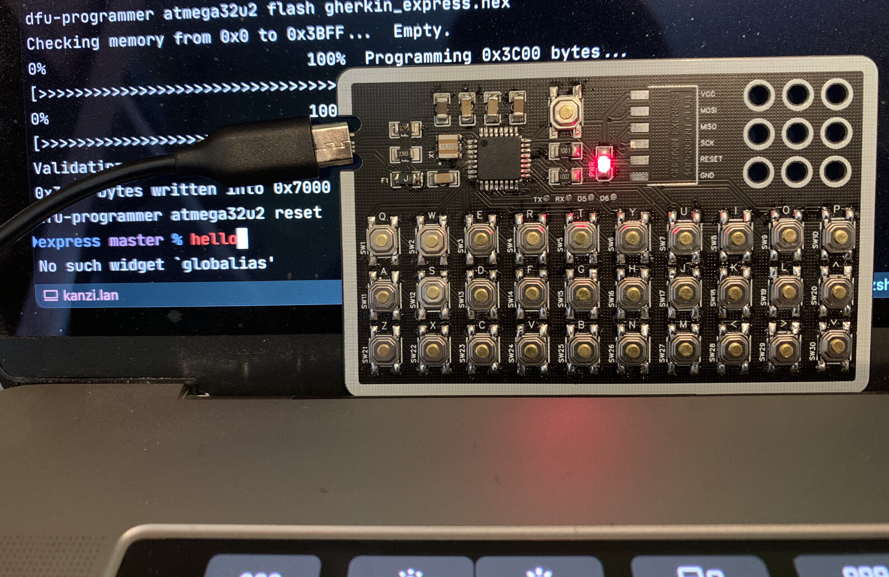

I just made myself a "Gherkin Express" 40% keyboard. It's as big as a credit card, but fairly thick because I accidentally ordered the wrong size PCB.

Still, it worked once I filed the connector down! Instructions etc. at: [https://www.40percent.club/2020/08/gherkin-express.html](https://www.40percent.club/2020/08/gherkin-express.html) as well as endless awesome tiny keyboard projects.

