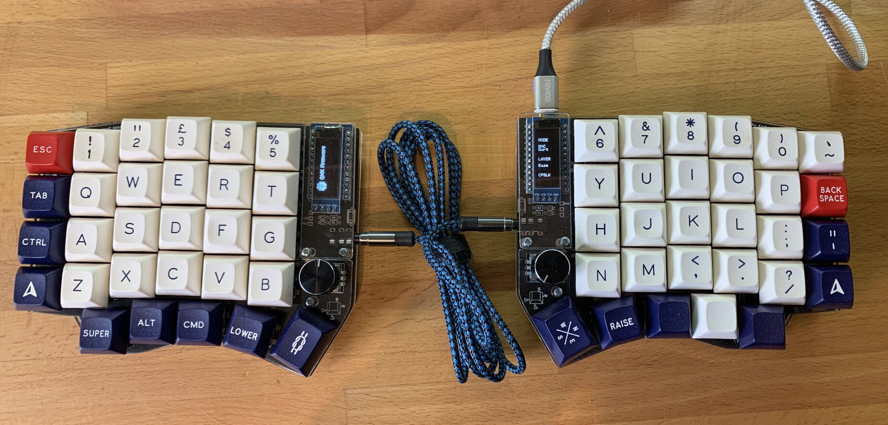

Also on the subject of keyboards I made myself a rev1 Sofle split board with Cherry Browns ( [https://github.com/josefadamcik/SofleKeyboard](https://github.com/josefadamcik/SofleKeyboard)).

I'm still tweaking the keymap and I'm not used to using it but it's fun. The two screens look cool too.

Here's a pic with Royal Nave 2 caps.

