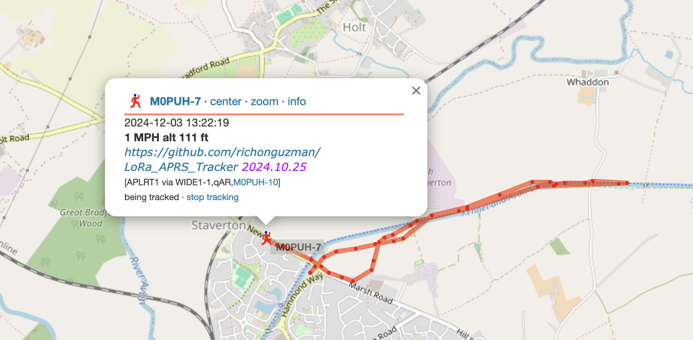

I went for a lunchtime run with a LILYGO T-Beam in my pocket running LoRa APRS tracker firmware ( [https://github.com/richonguzman/LoRa_APRS_Tracker](https://github.com/richonguzman/LoRa_APRS_Tracker)) on 70cm! It worked surprisingly well despite being a bit uncomfortable.

I flashed another LILYGO thingy with the I-gate firmware ( [https://github.com/richonguzman/LoRa_APRS_iGate](https://github.com/richonguzman/LoRa_APRS_iGate)) and attached that to my antenna at home.

Overall pretty cool and cheap, and worth trying on the car.

I found [https://lora-aprs.live/](https://lora-aprs.live/) pretty useful while setting things up.

[#lora](https://mastodon.radio/tags/lora) [#aprs](https://mastodon.radio/tags/aprs)

