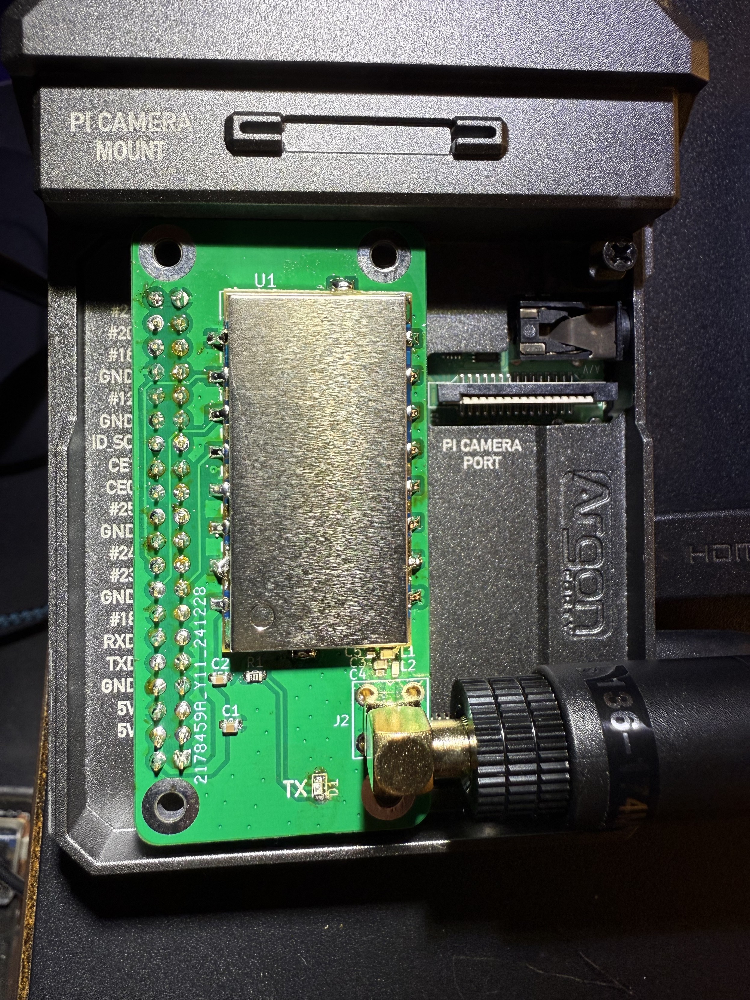
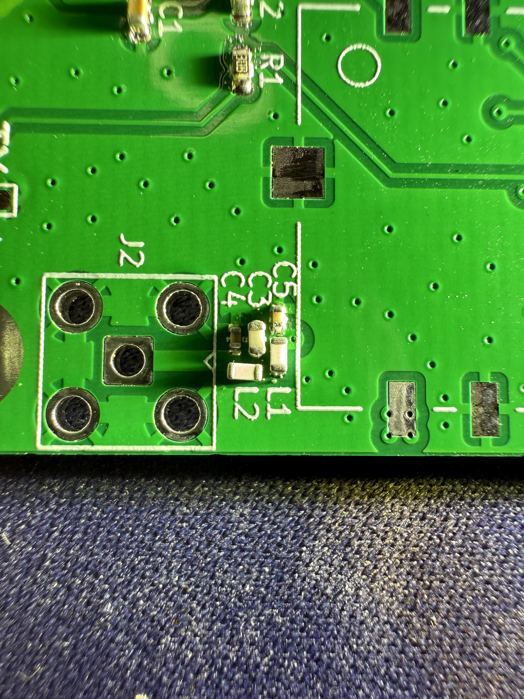

I'm not ready to declare victory just yet but I scratch built a CATS Pi i-gate - [https://cats.radio/pages/igate.html](https://cats.radio/pages/igate.html) - it's doing something when I run a tx test so 🤞

Some very small 0402 components here but not too many! I used a hot air gun this time but might try my modded toaster oven when I get time to try making the bigger tracker board - [https://gitlab.scd31.com/cats/mobile-transceiver](https://gitlab.scd31.com/cats/mobile-transceiver)

I didn't find build instructions but handily the kicad BOM has LCSC part numbers.

[#hamradio](https://mastodon.radio/tags/hamradio) [#cats](https://mastodon.radio/tags/cats)

