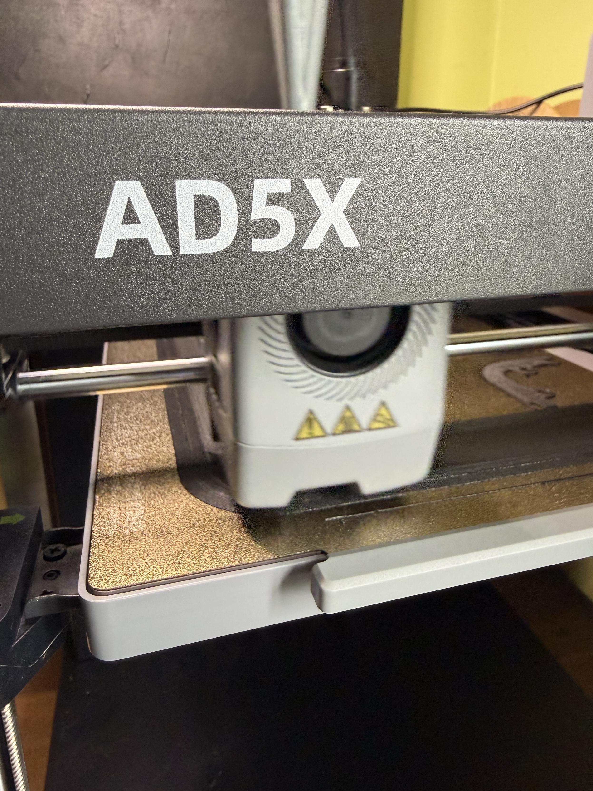

After years of umming and ahhing I finally got a 3D printer.

First big job is printing an enclosure for it, and so far things have been seamless!

[#3dprinting](https://mastodon.radio/tags/3dprinting)

